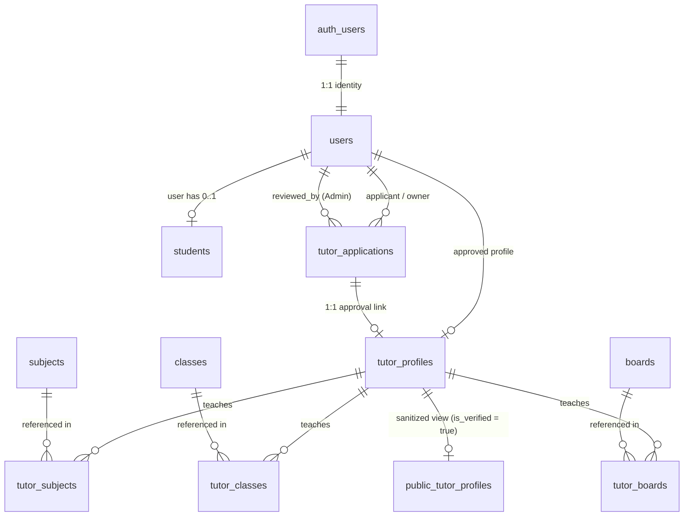

# Tutr — Database Architecture Documentation (Phase 2A)

Tutr is a hyperlocal tutoring marketplace connecting students with local tutors initially focused on **Balasore, Odisha, India**.

This document outlines the database design, schema relationships, security model, and integration boundaries for the Supabase / PostgreSQL backend established in Phase 2A.

---

## 1. High-Level Entity Relationship Diagram



---

## 2. Core Architectural Philosophy & Principles

### A. Identity vs. Roles (Multi-Role Future-Proofing)
* **`auth.users`**: Source of truth for authentication credentials (managed by Supabase Auth / Google OAuth).
* **`public.users`**: Source of truth for application-level identity (`id`, `email`, `full_name`, `avatar_url`).
* **`users.role`**: Used strictly for administrative authorization (`ADMIN` vs `USER`).
* **Student & Tutor Capabilities are NOT mutually exclusive**:
  * A user is a **Student** if they have a row in `public.students`.
  * A user is a **Tutor** if they have a row in `public.tutor_applications` and/or `public.tutor_profiles`.
  * One Google account can hold both a student record and a tutor profile simultaneously without schema conflicts or role collisions.

### B. Single Source of Truth for Marketplace Discovery
* Raw intake data originating from external forms (e.g. Google Forms) is temporarily staged as JSONB in `tutor_applications` (`subjects`, `classes`, `boards`).
* Once reviewed and approved, marketplace discovery **exclusively** queries the normalized junction tables:
  * `tutor_subjects`
  * `tutor_classes`
  * `tutor_boards`
* This prevents competing sources of truth, improves indexing performance, and eliminates JSON parsing when filtering by subject, class, or board in Balasore.

---

## 3. Database Schema Specification

### 1. `public.users`
| Column | Type | Constraints | Description |
| :--- | :--- | :--- | :--- |
| `id` | `UUID` | `PRIMARY KEY, REFERENCES auth.users(id) ON DELETE CASCADE` | 1:1 auth identity |
| `email` | `TEXT` | | User email from auth provider |
| `full_name` | `TEXT` | | User display name |
| `avatar_url` | `TEXT` | | Profile avatar image link |
| `role` | `user_role` | `NOT NULL DEFAULT 'USER'` | Authorization role (`USER`, `STUDENT`, `TUTOR`, `ADMIN`) |
| `created_at` | `TIMESTAMPTZ`| `NOT NULL DEFAULT clock_timestamp()` | Audit timestamp |
| `updated_at` | `TIMESTAMPTZ`| `NOT NULL DEFAULT clock_timestamp()` | Audit timestamp |

* **Security Guard (`trg_users_prevent_role_escalation`)**: Ordinary users are blocked at the database level from updating their own `role` to `'ADMIN'`. Only administrators can modify roles.

---

### 2. `public.students`
| Column | Type | Constraints | Description |
| :--- | :--- | :--- | :--- |
| `id` | `UUID` | `PRIMARY KEY DEFAULT gen_random_uuid()` | Unique student record |
| `user_id` | `UUID` | `UNIQUE NOT NULL, REFERENCES public.users(id) ON DELETE CASCADE` | Owner identity |
| `created_at` | `TIMESTAMPTZ`| `NOT NULL DEFAULT clock_timestamp()` | Creation timestamp |
| `updated_at` | `TIMESTAMPTZ`| `NOT NULL DEFAULT clock_timestamp()` | Last update timestamp |

* Kept intentionally minimal in Phase 2A. Future student preferences (classes, target boards, Balasore locality) will be added when student onboarding flows are finalized.

---

### 3. `public.tutor_applications`
| Column | Type | Constraints | Description |
| :--- | :--- | :--- | :--- |
| `id` | `UUID` | `PRIMARY KEY DEFAULT gen_random_uuid()` | Unique application ID |
| `user_id` | `UUID` | `REFERENCES public.users(id) ON DELETE SET NULL` | Linked applicant user |
| `google_response_id`| `TEXT` | *Partial Unique Index* | Google Forms response ID |
| `full_name` | `TEXT` | `NOT NULL` | Applicant name |
| `email` | `TEXT` | `NOT NULL` | Applicant contact email |
| `phone` | `TEXT` | | Contact telephone |
| `location` | `TEXT` | | Locality / Address in Balasore |
| `qualification` | `TEXT` | | Degrees & educational background |
| `experience` | `TEXT` | | Years / nature of teaching experience |
| `fee` | `TEXT` | | Fee expectations |
| `availability` | `TEXT` | | Hours / days available |
| `subjects` | `JSONB` | `DEFAULT '[]'::jsonb` | Raw subjects from intake form |
| `classes` | `JSONB` | `DEFAULT '[]'::jsonb` | Raw target classes from intake form |
| `boards` | `JSONB` | `DEFAULT '[]'::jsonb` | Raw boards from intake form |
| `documents` | `JSONB` | `DEFAULT '[]'::jsonb` | Uploaded certificate/ID references |
| `status` | `application_status`| `NOT NULL DEFAULT 'PENDING'` | Application lifecycle state |
| `submitted_at` | `TIMESTAMPTZ`| `NOT NULL DEFAULT clock_timestamp()` | Submission timestamp |
| `reviewed_at` | `TIMESTAMPTZ`| | Review timestamp |
| `reviewed_by` | `UUID` | `REFERENCES public.users(id) ON DELETE SET NULL` | Admin reviewer ID |
| `rejection_reason`| `TEXT` | | Feedback if rejected |
| `created_at` | `TIMESTAMPTZ`| `NOT NULL DEFAULT clock_timestamp()` | Audit timestamp |
| `updated_at` | `TIMESTAMPTZ`| `NOT NULL DEFAULT clock_timestamp()` | Audit timestamp |

---

### 4. `public.tutor_profiles`
| Column | Type | Constraints | Description |
| :--- | :--- | :--- | :--- |
| `id` | `UUID` | `PRIMARY KEY DEFAULT gen_random_uuid()` | Public marketplace tutor ID |
| `user_id` | `UUID` | `UNIQUE NOT NULL, REFERENCES public.users(id) ON DELETE CASCADE` | Tutor account |
| `application_id` | `UUID` | `UNIQUE, REFERENCES public.tutor_applications(id) ON DELETE SET NULL` | Source verified application |
| `display_name` | `TEXT` | `NOT NULL` | Public educator name |
| `photo_url` | `TEXT` | | Profile photo |
| `bio` | `TEXT` | | Tutor introduction |
| `qualification` | `TEXT` | | Verified qualifications |
| `experience` | `TEXT` | | Teaching experience summary |
| `locality` | `TEXT` | | Area in Balasore |
| `teaching_areas` | `TEXT` | | Preferred teaching format |
| `fee` | `TEXT` | | Public hourly/monthly fee display |
| `availability` | `TEXT` | | Available time slots |
| `is_verified` | `BOOLEAN` | `NOT NULL DEFAULT false` | Verified status flag |
| `created_at` | `TIMESTAMPTZ`| `NOT NULL DEFAULT clock_timestamp()` | Creation timestamp |
| `updated_at` | `TIMESTAMPTZ`| `NOT NULL DEFAULT clock_timestamp()` | Last updated timestamp |

* **Security Guard (`trg_prevent_tutor_self_verification`)**: Tutors can edit their own `bio`, `photo_url`, and `fee`, but can never change `is_verified`.

---

### 5. `public.public_tutor_profiles` (Sanitized View)
* Defined with `WITH (security_invoker = true)` to respect Row Level Security.
* Only includes tutors where `is_verified = true`.
* **Exposes ONLY**: `id`, `display_name`, `photo_url`, `bio`, `qualification`, `experience`, `locality`, `teaching_areas`, `fee`, `availability`, `is_verified`, `created_at`.
* **Completely omits**: `phone`, `email`, `documents`, `google_response_id`, `admin notes`, `rejection_reason`, `reviewed_by`, and `user_id`.

---

### 6. Reference & Junction Tables
* **`public.subjects`**: Seeded with 10 standard Balasore subjects (Mathematics, Physics, Chemistry, Biology, English, Odia, Computer Science, Social Science, Science, Hindi).
* **`public.classes`**: Seeded with Class 1 through Class 12 with explicit `sort_order`.
* **`public.boards`**: Seeded with target boards (BSE Odisha, CHSE Odisha, CBSE, ICSE).
* **Junction Tables**:
  * `public.tutor_subjects` (`tutor_id`, `subject_id`)
  * `public.tutor_classes` (`tutor_id`, `class_id`)
  * `public.tutor_boards` (`tutor_id`, `board_id`)

---

## 4. Application Lifecycle & Status Transitions

```text
       ┌───────────────┐
       │    PENDING    │
       └───────┬───────┘
               │
               ▼
       ┌───────────────┐
       │ UNDER_REVIEW  │
       └───┬───────┬───┘
           │       │
    Approved       Rejected
           ▼       ▼
┌──────────────┐  ┌──────────────┐
│   APPROVED   │  │   REJECTED   │
└──────────────┘  └──────┬───────┘
                         │ (Appeal / Reopen)
                         ▼
                  ┌──────────────┐
                  │ UNDER_REVIEW │
                  └──────────────┘
```

### Transition Rules Enforced by Database Triggers:
1. **Ordinary Applicants**:
   * Cannot alter `status`, `reviewed_at`, `reviewed_by`, or `rejection_reason`.
   * Can only edit application fields while status is strictly `'PENDING'`. Once review commences (`UNDER_REVIEW`), applicant edits are locked.
2. **Administrators**:
   * Permitted transitions:
     * `PENDING → UNDER_REVIEW`
     * `UNDER_REVIEW → APPROVED`
     * `UNDER_REVIEW → REJECTED`
     * `PENDING → APPROVED` (direct fast-track approval)
     * `PENDING → REJECTED` (direct spam rejection)
     * `REJECTED → UNDER_REVIEW` (re-evaluation upon submission of additional proof)
   * On approval or rejection, the trigger automatically records `reviewed_at = clock_timestamp()` and `reviewed_by = auth.uid()`.

---

## 5. User Deletion & Retention Policy

Careful foreign-key `ON DELETE` rules protect audit integrity and prevent orphaned rows:

| Target Table | Foreign Key | On Delete Rule | Rationale |
| :--- | :--- | :--- | :--- |
| `public.users` | `auth.users(id)` | `CASCADE` | User deletion removes app identity. |
| `public.students` | `public.users(id)`| `CASCADE` | Student profile is personal to user. |
| `public.tutor_profiles` | `public.users(id)`| `CASCADE` | Deleting user unpublishes marketplace profile. |
| `public.tutor_applications`| `public.users(id)`| `SET NULL` | **Critical Audit Rule**: Preserves legal, certificate, and verification records even if user account is closed. |
| Junction tables | `tutor_profiles(id)`| `CASCADE` | Cleaning up tutor automatically removes junction links. |

---

## 6. Row Level Security (RLS) Matrix

| Table | Anonymous User (`anon`) | Authenticated Student / Tutor | Admin (`ADMIN`) |
| :--- | :--- | :--- | :--- |
| `users` | Denied | Read/Update own row only (role locked) | Read/Update/Delete all |
| `students` | Denied | Read/Write own row only (`user_id = auth.uid()`) | Full Access |
| `tutor_applications` | Denied | Read own row only; Update while PENDING | Full Access |
| `tutor_profiles` | Read verified profiles only | Read verified + own profile; Update own | Full Access |
| `public_tutor_profiles` | Read verified tutors | Read verified tutors | Full Access |
| `subjects`, `classes`, `boards` | Read all | Read all | Full Access |
| Junction tables | Read for verified tutors | Read verified + own; Write own | Full Access |

---

## 7. Google Forms Integration Boundary

### Future Integration Architecture
```text
Google Form (Tutor Intake)
          │
          ▼
Google Forms API (Serverless Sync Job / Webhook)
          │
          ▼
tutor_applications.google_response_id
(Unique constraint prevents duplicate imports)
          │
          ▼
Admin Review & Approval
          │
          ▼
Populate tutor_profiles + tutor_subjects / classes / boards
```

### Key Considerations:
* **Duplicate Prevention**: `idx_tutor_applications_google_response_id` is a partial unique index (`WHERE google_response_id IS NOT NULL`). Direct manual records with `NULL` coexist safely without collisions.
* **Decoupled User Identity**: Google Form submissions may arrive before the tutor has completed Google OAuth signup on Tutr. The ingestion pipeline can stage the application with `user_id = NULL` and associate it during email matching on first login.

---

## 8. Phase 2B Security & Validation Confirmation

In Phase 2B, all 14 security, integrity, and lifecycle requirements were executed and verified against the live connected Supabase project (`jpjrkkdsaxskcgpqrwka`).

* **Detailed Security Report**: See [`docs/database-security.md`](file:///Users/debashismohanty/Downloads/Tutr%20bls/docs/database-security.md).
* **Automated Security Test Suite**: See [`supabase/tests/database_security_test.sql`](file:///Users/debashismohanty/Downloads/Tutr%20bls/supabase/tests/database_security_test.sql).
* **Summary of Validation**:
  - All 14 test categories passed with zero regressions.
  - Zero sensitive data leakage from `public_tutor_profiles`.
  - Role escalation prevention confirmed on live database.
  - Lifecycle state transitions strictly guarded.
  - Account deletion cascade and audit retention confirmed.

